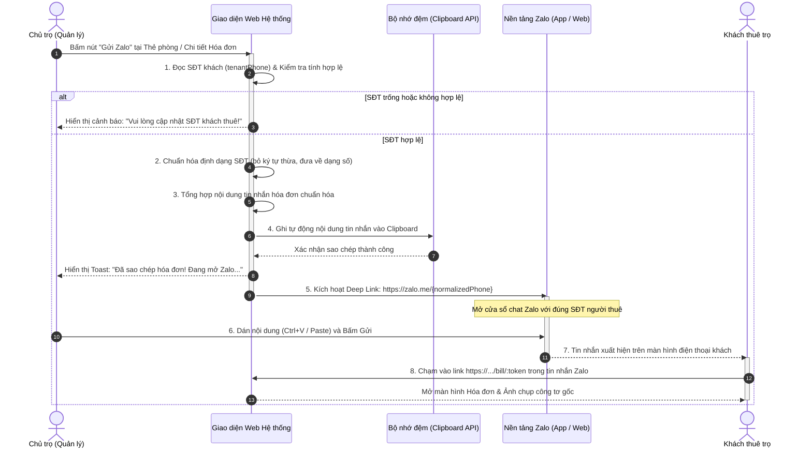

# AppFlow (Luồng Người Dùng & Điều Hướng)
## Dự án: Module Số Hóa Chốt Chỉ Số Điện Nước & Đối Soát Thanh Toán Hai Chiều Cho Khu Nhà Trọ

---

### 1. Tổng quan cấu trúc điều hướng (Navigation Map)

```mermaid
flowchart TD
    subgraph Landlord["PHÂN HỆ CHỦ TRỌ (Quản trị viên - Google Auth SDK)"]
        L_Auth["1. Đăng nhập Google"] --> L_Dash["2. Dashboard Công nợ"]
        L_Dash --> L_Rooms["Quản lý Danh mục Phòng & Đơn giá"]
                L_Record["3. Chốt chỉ số & Tải ảnh công tơ thực tế"] --> L_GenBill["4. Tự động tính tiền & Xuất hóa đơn"]
        L_GenBill --> L_Zalo["4b. Gửi hóa đơn 1-chạm qua Zalo (SĐT khách)"]
        
        L_DisputeView["6b. Xem ảnh đối chứng của khách"] --> L_Adjust["7. Điều chỉnh lại chỉ số nếu sai"]
        L_VerifyPay["9. Kiểm tra biến động số dư & Bấm duyệt"] --> L_Close["10. Khóa sổ (PAID) & Cập nhật Dashboard"]
    end

    subgraph Tenant["PHÂN HỆ NGƯỜI THUÊ (Link tra cứu bảo mật /bill/:token)"]
        T_Link["Khách nhận Tin nhắn & Link tra cứu qua Zalo"] --> T_View["5. Mở hóa đơn & Đối chiếu ảnh công tơ gốc"]
        
        T_View -->|Phát hiện sai lệch| T_Dispute["6a. Báo sai lệch & Tải ảnh đối chứng"]
        T_View -->|Số liệu chuẩn xác| T_Confirm["Xác nhận đúng chỉ số"]
        
        T_Confirm --> T_Pay["8. Quét mã VietQR động NAPAS để chuyển khoản"]
        T_Done["11. Hiển thị biên lai: ĐÃ THANH TOÁN (PAID)"]
    end

    %% Luồng tương tác đối soát hai chiều (Two-way Loop)
    L_Zalo ==>|Mở zalo.me/{phone} & gửi link hóa đơn /bill/:token| T_Link
    T_Dispute ==>|Báo động khiếu nại DISPUTED (Trạng thái 2)| L_DisputeView
    L_Adjust ==>|Tự động cập nhật lại hóa đơn (Trạng thái 1)| T_View
    T_Pay ==>|Khách chuyển khoản trực tiếp| L_VerifyPay
    L_Close ==>|Tự động đóng công nợ kỳ (Trạng thái 3)| T_Done
```

---

### 2. Chi tiết các luồng của Chủ Trọ (Landlord Flows)

#### Flow L1: Đăng nhập Google & Thiết lập nhận tiền VietQR
1. Chủ trọ truy cập trang web hệ thống.
2. Nhấn nút **"Đăng nhập với Google"** (Google Identity Services popup).
3. Hệ thống xác thực danh tính qua Google Auth SDK và lưu thông tin người dùng vào MongoDB.
4. **Kiểm tra lần đầu:** Nếu chủ trọ chưa cấu hình tài khoản ngân hàng, hệ thống hiển thị thông báo nhắc nhở vào menu "Cài đặt thanh toán":
   - Chọn Ngân hàng (danh sách hơn 50 ngân hàng Việt Nam theo mã BIN chuẩn).
   - Nhập Số tài khoản & Tên chủ tài khoản thụ hưởng.
   - Bấm "Lưu thông tin" (thông tin này sẽ dùng để sinh mã VietQR tự động).

#### Flow L2: Quản lý danh mục phòng trọ & Đơn giá
1. Chủ trọ vào mục **"Quản lý phòng"**.
2. Xem danh sách phòng dạng lưới (Card) hoặc bảng: Mã phòng, Người thuê đại diện, SĐT, Giá thuê, Đơn giá điện/nước/dịch vụ.
3. Bấm **"Thêm phòng mới"**:
   - Nhập: Tên phòng (ví dụ: `Phòng 101`), Người đại diện thuê, Số điện thoại.
   - Nhập đơn giá áp dụng riêng cho phòng này (hoặc lấy mặc định): Tiền phòng/tháng, Giá điện (đ/kWh), Giá nước (đ/m³), Phí dịch vụ (Wifi, rác, gửi xe).
   - Nhập chỉ số điện/nước ban đầu (chỉ số cơ sở lúc bắt đầu nhận phòng).
4. Lưu và quay lại danh sách. Có thể bấm Sửa hoặc Xóa phòng khi cần.

#### Flow L3: Chốt chỉ số điện nước cuối tháng & Xuất hóa đơn
1. Vào mục **"Chốt số & Hóa đơn"**, chọn kỳ chốt (mặc định là tháng hiện tại `MM/YYYY`).
2. Danh sách phòng hiển thị các trạng thái theo mã số:
   - `0` - **Chưa chốt số** (Phòng chưa ghi nhận chỉ số kỳ này)
   - `1` - **Đã gửi hóa đơn** (Đã chốt số & gửi link cho khách đối soát)
   - `2` - **Khách khiếu nại** (Khách báo sai lệch chỉ số kèm ảnh đối chứng)
   - `3` - **Đã thanh toán** (Chủ trọ đã nhận tiền & khóa sổ công nợ)
3. Bấm vào phòng có trạng thái `0 - Chưa chốt số`:
   - Hệ thống tự động điền sẵn **Chỉ số điện cũ** và **Chỉ số nước cũ** (lấy từ kỳ trước).
   - Chủ trọ nhập **Chỉ số điện mới** và **Chỉ số nước mới** (hệ thống tự validate: nếu số mới < số cũ sẽ báo lỗi ngay).
   - **Bắt buộc tải ảnh minh chứng:**
     - Nút "Chụp/Tải ảnh đồng hồ điện" (mở camera trực tiếp trên điện thoại).
     - Nút "Chụp/Tải ảnh đồng hồ nước".
   - Hệ thống tức thời hiển thị bảng tính:
     - Số kWh tiêu thụ $\times$ Đơn giá điện = Tiền điện.
     - Số m³ tiêu thụ $\times$ Đơn giá nước = Tiền nước.
     - Tiền phòng cố định + Các khoản phí dịch vụ.
     - **TỔNG CỘNG TIỀN PHẢI THU**.
4. Chủ trọ nhấn nút **"Chốt số & Tạo hóa đơn"**:
   - Hóa đơn lưu vào cơ sở dữ liệu với trạng thái `1` (Đã gửi hóa đơn - Chờ khách đối soát).
   - Hệ thống sinh mã Token bảo mật duy nhất cho hóa đơn.
   - Hiển thị hộp thoại chốt số thành công với lựa chọn **"Gửi Zalo cho khách"** hoặc **"Xem chi tiết hóa đơn"**.

#### Flow L3.1: Quy trình Nghiệp vụ Gửi Hóa đơn qua Zalo theo Số điện thoại Khách thuê (Zalo Quick-Send)

##### 1. Mục đích & Ý nghĩa nghiệp vụ
- Khắc phục triệt để bất cập trong phương thức truyền thống: Chủ trọ phải copy từng số tiền, mở Zalo tìm tên khách, gõ tin nhắn thủ công dễ nhầm lẫn số liệu hoặc gửi nhầm phòng.
- Tạo trải nghiệm **"1 Chạm - Tức thời - Không tốn phí"** (Zero SMS/ZNS fee), tận dụng nền tảng liên lạc phổ biến nhất Việt Nam (Zalo).
- Đảm bảo tính pháp lý và đối soát: Tin nhắn gửi qua Zalo luôn kèm đường dẫn bảo mật `/bill/:token` dẫn trực tiếp đến ảnh chụp công tơ thực tế và mã VietQR chuẩn xác.

##### 2. Sơ đồ tuần tự nghiệp vụ (Sequence Diagram)



##### 3. Chi tiết các bước thực hiện trong luồng

- **Bước 1: Tiền kiểm & Chuẩn hóa Số điện thoại người thuê (`tenantPhone`):**
  - Hệ thống kiểm tra trường SĐT trong hồ sơ phòng.
  - Chuẩn hóa: Loại bỏ khoảng trắng, dấu gạch ngang `.` `-`, loại bỏ tiền tố quốc tế `+84` hoặc `84` thành đầu số `0` tiêu chuẩn hoặc định dạng số nguyên thủy mà `zalo.me` hỗ trợ (`zalo.me/09xxxxxxxx`).
  
- **Bước 2: Tự động biên tập nội dung bản tin Hóa đơn chuẩn hóa:**
  Mẫu tin nhắn được cấu trúc mạch lạc, trang trọng và minh bạch:
  ```text
  🏠 [NHÀ TRỌ 247] - THÔNG BÁO TIỀN PHÒNG KỲ THÁNG {thang}/{nam}
  Kính gửi: Bạn {ten_khach} - {ten_phong}
  
  Chi tiết chi phí kỳ này:
  1. Tiền phòng: {tien_phong} đ
  2. Tiền điện ({so_dien_cu} -> {so_dien_moi} = {kwh} kWh): {tien_dien} đ
  3. Tiền nước ({so_nuoc_cu} -> {so_nuoc_moi} = {m3} m³): {tien_nuoc} đ
  4. Phí dịch vụ (Wifi, rác, vệ sinh): {tien_dich_vu} đ
  👉 TỔNG CỘNG CẦN THANH TOÁN: {tong_tien} đ
  
  📸 Quý khách vui lòng bấm vào link bảo mật dưới đây để xem ẢNH CHỤP CÔNG TƠ THỰC TẾ và quét mã VIETQR thanh toán:
  🔗 {url_hoa_don_bao_mat}
  
  (Vui lòng phản hồi xác nhận hoặc báo sai lệch chỉ số trên link trong vòng 24h. Trân trọng cảm ơn!)
  ```

- **Bước 3: Thực thi cơ chế 1-Chạm (Clipboard + Deep Link):**
  - Sử dụng API `navigator.clipboard.writeText(messageTemplate)` để lưu trữ toàn bộ văn bản vào clipboard.
  - Sử dụng lệnh điều hướng `window.open('https://zalo.me/' + cleanPhone, '_blank')`:
    - Trên điện thoại: Tự động kích hoạt ứng dụng Zalo đã cài đặt, chuyển đến ngay màn hình chat với khách.
    - Trên máy tính: Mở tab trình duyệt Zalo Web hoặc chuyển tiếp sang Zalo PC.
  - Hiển thị Toast thông báo trạng thái: *"Đã sao chép nội dung hóa đơn! Đang mở cuộc trò chuyện Zalo với khách."*

- **Bước 4: Xử lý các tình huống ngoại lệ & Kịch bản dự phòng (Fallbacks):**
  - *Trường hợp phòng chưa có SĐT:* Hiển thị thông báo yêu cầu cập nhật SĐT, đồng thời cung cấp nút **"Sao chép nội dung & Link"** thủ công để chủ trọ có thể gửi qua ứng dụng khác (Messenger, Telegram, Viber).
  - *Trường hợp khách chặn tin nhắn từ số lạ trên Zalo:* Do tin nhắn đã được lưu vào clipboard, chủ trọ có thể gửi yêu cầu kết bạn hoặc dán tin nhắn gửi qua SMS truyền thống ngay tức khắc.
  - *Trường hợp trình duyệt chặn pop-up:* Hệ thống phát hiện và hiển thị hộp thoại chứa liên kết trực tiếp kèm nút **"Bấm vào đây để mở Zalo"**.

#### Flow L4: Xử lý phản hồi sai lệch (Dispute Resolution)
1. Khi người thuê bấm báo sai lệch, hóa đơn trên Dashboard của chủ trọ sẽ hiển thị nhãn đỏ **`2 - Khách khiếu nại`**.
2. Chủ trọ bấm vào chi tiết hóa đơn:
   - Đọc lý do khiếu nại của khách.
   - Xem ảnh chụp đối chứng do khách vừa tải lên, đối chiếu cạnh bên (side-by-side) với ảnh chụp gốc của chủ trọ.
3. Chủ trọ kiểm tra lại công tơ vật lý:
   - Nếu khách đúng: Bấm nút **"Điều chỉnh chỉ số"**, nhập lại chỉ số đúng (có thể chụp lại ảnh mới nếu cần).
   - Hệ thống tự động tính toán lại toàn bộ tiền và chuyển trạng thái về `1 - Đã gửi hóa đơn` (cập nhật ngay lập tức vào link tra cứu của khách).

#### Flow L5: Đối soát thanh toán & Khóa sổ
1. Người thuê sau khi quét VietQR thanh toán tiền.
2. Chủ trọ kiểm tra app ngân hàng thấy tiền đã vào tài khoản.
3. Chủ trọ mở chi tiết hóa đơn, bấm nút **"Xác nhận đã nhận tiền"**:
   - Trạng thái hóa đơn chuyển sang **`3 - Đã thanh toán`**.
   - Khóa toàn bộ dữ liệu hóa đơn kỳ này (chống chỉnh sửa).
   - Dữ liệu tự động cập nhật vào Bảng điều khiển công nợ.

#### Flow L6: Bảng điều khiển công nợ (Debt Dashboard)
1. Màn hình tổng quan hiển thị các thẻ tóm tắt (Cards):
   - **Tổng doanh thu dự kiến** vs **Doanh thu thực thu**.
   - **Tỷ lệ thu tiền:** `%` số phòng đã thanh toán.
   - **Bộ lọc trạng thái:** Tất cả | `0 - Chưa chốt` | `1 - Đã gửi` | `2 - Khiếu nại` | `3 - Đã thanh toán`.
2. Danh sách phòng kèm nút hành động nhanh:
   - Xem hóa đơn.
   - Copy link nhắc nợ gửi Zalo.
   - Xác nhận thanh toán nhanh.

---

### 3. Chi tiết các luồng của Người Thuê (Tenant Flows - Public Mobile View)

#### Flow T1: Mở liên kết tra cứu hóa đơn
1. Người thuê nhận được tin nhắn Zalo kèm đường link: `https://.../bill/:token`.
2. Mở đường link trên trình duyệt smartphone (không cần đăng nhập, không cần cài app).
3. Màn hình hiển thị giao diện hóa đơn tối ưu mobile:
   - Thông tin kỳ: Tháng `MM/YYYY` - Tên phòng `P.101`.
   - Bảng kê chi tiết: Tiền phòng, Tiền điện ($Số\ mới - Số\ cũ \times Đơn\ giá$), Tiền nước, Phí rác, Wifi.
   - **Khu vực minh chứng thực tế:** Hiển thị 2 ảnh chụp mặt đồng hồ điện và nước do chủ trọ chụp. Người thuê có thể chạm để phóng to kiểm tra số đo trên mặt kính đồng hồ.

#### Flow T2: Hành động đối soát hai chiều
- **Lựa chọn A: "Xác nhận đúng chỉ số"**
  1. Người thuê chạm vào nút **"Xác nhận đúng chỉ số"** (Màu xanh nổi bật).
  2. Hệ thống cập nhật trạng thái hóa đơn thành `CONFIRMED`.
  3. Màn hình tự động cuộn xuống phần thông tin thanh toán VietQR.

- **Lựa chọn B: "Báo sai lệch chỉ số"**
  1. Nếu phát hiện chủ trọ nhìn nhầm số hoặc công tơ nhảy sai: Khách chạm vào nút **"Báo sai lệch"** (Màu cam/đỏ).
  2. Mở cửa sổ nhỏ (Modal):
     - Nhập nội dung phản ánh (Ví dụ: *"Số điện trên đồng hồ của em hiện tại chỉ là 1.250 chứ không phải 1.350 ạ"*).
     - Bắt buộc chạm vào nút **"Chụp ảnh đồng hồ thực tế của bạn"** để tải ảnh đối chứng.
  3. Bấm **"Gửi báo cáo sai lệch"**:
     - Hóa đơn chuyển trạng thái sang `DISPUTED`.
     - Màn hình người thuê hiển thị thông báo: *"Đã gửi phản hồi thành công. Vui lòng chờ chủ trọ kiểm tra lại."*

#### Flow T3: Thanh toán VietQR & Xem biên lai
1. Tại khu vực thanh toán:
   - Hiển thị **Mã QR VietQR** tự động sinh theo chuẩn NAPAS 247.
   - Phía dưới mã QR có đầy đủ: Ngân hàng, Số tài khoản, Tên chủ thụ hưởng, Số tiền chính xác (đã làm tròn chuẩn), Nội dung chuyển khoản cố định (Ví dụ: `P101 TIEN NHA THANG 09`).
   - Nút **"Lưu ảnh QR"** và nút **"Sao chép STK / Nội dung"**.
2. Người thuê mở ứng dụng ngân hàng bất kỳ (Vietcombank, MBBank, Techcombank, MoMo...), quét mã QR và xác nhận chuyển khoản.
3. Khi chủ trọ bấm duyệt thanh toán ở phía quản trị, trang hóa đơn của khách tự động cập nhật nhãn **"ĐÃ HOÀN TẤT THANH TOÁN (PAID)"** với dấu tích xanh hoàn thành.
