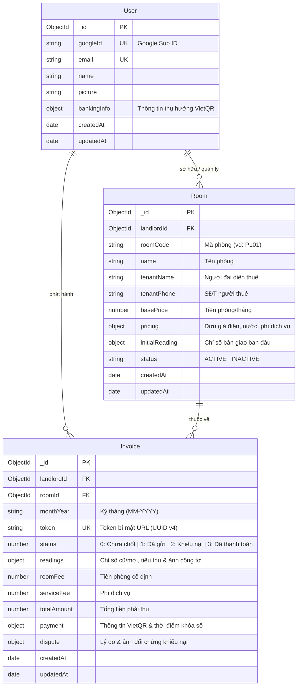

# Schema (Thiết Kế Cơ Sở Dữ Liệu MongoDB)
## Dự án: Module Số Hóa Chốt Chỉ Số Điện Nước & Đối Soát Thanh Toán Hai Chiều Cho Khu Nhà Trọ

---

### 1. Sơ đồ thực thể & Mối quan hệ (Entity Relationship)



---

### 2. Chi tiết các Collections & Mongoose Schemas

#### 2.1. Collection: `users` (Chủ trọ)
Lưu trữ thông tin tài khoản quản trị viên được định danh qua Google SDK và thông tin tài khoản ngân hàng để sinh mã VietQR.

```javascript
const userSchema = new mongoose.Schema({
  googleId: {
    type: String,
    required: true,
    unique: true,
    index: true,
    trim: true,
  },
  email: {
    type: String,
    required: true,
    unique: true,
    lowercase: true,
    trim: true,
  },
  name: {
    type: String,
    required: true,
    trim: true,
  },
  picture: {
    type: String,
    default: '',
  },
  bankingInfo: {
    bankCode: { type: String, default: '' },       // Mã ngân hàng hoặc BIN (ví dụ: '970436' - VCB)
    bankName: { type: String, default: '' },       // Tên thương mại (ví dụ: 'Vietcombank')
    accountNumber: { type: String, default: '' },  // Số tài khoản thụ hưởng
    accountHolder: { type: String, default: '' },  // Tên chủ sở hữu tài khoản (VIET HOA KHONG DAU)
  },
}, { timestamps: true });
```

---

#### 2.2. Collection: `rooms` (Danh mục phòng trọ)
Quản lý từng phòng trọ thuộc sở hữu của chủ trọ, thiết lập đơn giá điện/nước riêng hoặc theo định mức.

```javascript
const roomSchema = new mongoose.Schema({
  landlordId: {
    type: mongoose.Schema.Types.ObjectId,
    ref: 'User',
    required: true,
    index: true,
  },
  roomCode: {
    type: String,
    required: true,
    trim: true, // ví dụ: "101", "P.201"
  },
  name: {
    type: String,
    required: true,
    trim: true, // ví dụ: "Phòng 101 - Tầng 1"
  },
  tenantName: {
    type: String,
    required: true,
    trim: true, // ví dụ: "Nguyễn Văn A"
  },
  tenantPhone: {
    type: String,
    required: true,
    trim: true, // ví dụ: "0912345678"
  },
  basePrice: {
    type: Number,
    required: true,
    min: 0, // Tiền thuê phòng hàng tháng (VNĐ)
  },
  pricing: {
    electricityUnitPrice: { type: Number, required: true, default: 3500 }, // VNĐ / kWh
    waterUnitPrice: { type: Number, required: true, default: 25000 },      // VNĐ / m³
    serviceFee: { type: Number, default: 100000 },                         // Wifi, vệ sinh, rác gộp (VNĐ)
  },
  initialReading: {
    electricity: { type: Number, default: 0 }, // Số điện ngày bàn giao phòng
    water: { type: Number, default: 0 },       // Số nước ngày bàn giao phòng
  },
  status: {
    type: String,
    enum: ['ACTIVE', 'INACTIVE'],
    default: 'ACTIVE',
  }
}, { timestamps: true });

// Compound Index: Đảm bảo mã phòng không bị trùng lặp trong cùng 1 chủ trọ
roomSchema.index({ landlordId: 1, roomCode: 1 }, { unique: true });
```

---

#### 2.3. Collection: `invoices` (Hóa đơn chốt số & Đối soát hai chiều)
Bản ghi trung tâm của hệ thống, chứa toàn bộ chu trình tính toán, ảnh bằng chứng công tơ, mã VietQR và trạng thái đối soát.

```javascript
const invoiceSchema = new mongoose.Schema({
  landlordId: {
    type: mongoose.Schema.Types.ObjectId,
    ref: 'User',
    required: true,
    index: true,
  },
  roomId: {
    type: mongoose.Schema.Types.ObjectId,
    ref: 'Room',
    required: true,
    index: true,
  },
  monthYear: {
    type: String,
    required: true,
    index: true, // Định dạng "MM-YYYY" (ví dụ: "09-2026")
  },
  token: {
    type: String,
    required: true,
    unique: true,
    index: true, // Chuỗi UUID v4 bí mật phục vụ tra cứu bảo mật: /bill/:token
  },
  status: {
    type: Number,
    required: true,
    enum: [0, 1, 2, 3],
    default: 0,
    index: true,
    // 0: Chưa chốt số (Bản nháp / phòng chưa nhập số mới kỳ này)
    // 1: Đã gửi hóa đơn (Đã chốt số & gửi link cho khách đối soát)
    // 2: Khách khiếu nại (Khách báo sai lệch chỉ số kèm ảnh đối chứng)
    // 3: Đã thanh toán (Chủ trọ đã nhận tiền & khóa sổ công nợ)
  },
  readings: {
    electricity: {
      oldIndex: { type: Number, default: 0 },      // Chỉ số cũ kỳ trước
      newIndex: { type: Number, default: 0 },      // Chỉ số mới chốt
      consumption: { type: Number, default: 0 },   // Số kWh = new - old
      unitPrice: { type: Number, default: 0 },     // Đơn giá áp dụng
      amount: { type: Number, default: 0 },        // Thành tiền điện
      meterPhoto: { type: String, default: '' },   // Đường dẫn ảnh chụp công tơ điện gốc của chủ trọ
    },
    water: {
      oldIndex: { type: Number, default: 0 },
      newIndex: { type: Number, default: 0 },
      consumption: { type: Number, default: 0 },
      unitPrice: { type: Number, default: 0 },
      amount: { type: Number, default: 0 },
      meterPhoto: { type: String, default: '' },   // Đường dẫn ảnh chụp công tơ nước gốc của chủ trọ
    },
  },
  roomFee: {
    type: Number,
    required: true,
    default: 0, // Tiền thuê phòng
  },
  serviceFee: {
    type: Number,
    default: 0, // Tổng phí dịch vụ (Wifi, rác...)
  },
  totalAmount: {
    type: Number,
    required: true,
    default: 0, // roomFee + readings.electricity.amount + readings.water.amount + serviceFee
  },
  payment: {
    qrUrl: { type: String, default: '' },          // Link ảnh VietQR động chuẩn NAPAS
    paidAt: { type: Date, default: null },         // Thời điểm chủ trọ ấn duyệt thanh toán
    note: { type: String, default: '' },           // Ghi chú thanh toán
  },
  dispute: {
    tenantReason: { type: String, default: '' },   // Lý do khách khiếu nại sai lệch
    tenantPhoto: { type: String, default: '' },    // Ảnh công tơ do khách chụp đối chứng
    disputedAt: { type: Date, default: null },     // Thời điểm gửi khiếu nại
    resolvedAt: { type: Date, default: null },     // Thời điểm chủ trọ điều chỉnh xong
  },
}, { timestamps: true });

// Compound Index: Mỗi phòng chỉ có 1 hóa đơn cho 1 kỳ tháng nhất định
invoiceSchema.index({ roomId: 1, monthYear: 1 }, { unique: true });
```

---

### 3. Quy tắc toàn vẹn dữ liệu (Data Integrity Rules)
1. **Kiểm tra chỉ số đo:** `newIndex` luôn luôn phải $\ge$ `oldIndex`. Nếu người dùng nhập sai, tầng controller và schema validator sẽ từ chối lưu.
2. **Tính toán tự động:** `totalAmount` luôn bằng tổng các thành phần: $Tiền\ phòng + Tiền\ điện + Tiền\ nước + Phí\ dịch\ vụ$.
3. **Khóa chỉnh sửa khi trạng thái = 3 (Đã thanh toán):** Khi `status === 3`, hệ thống đóng băng toàn bộ các trường dữ liệu chỉ số và số tiền, không cho phép can thiệp để bảo toàn số liệu kế toán.
